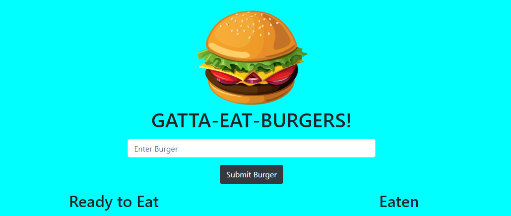

# Gatta-Eat-Burgers (Burger logger)

The repo is a simple "burger logger" created with with MySQL, Node, Express, Handlebars and a self designed ORM. This repo, as well as most of my repos, follow MVC design pattern. I used Node and MySQL to query and route data, and Handlebars to generate the HTML.

## Preview
  

## Usage 
GATTA-EAT-BURGERS! is a restaurant app that lets users input the names of burgers they'd like to eat.
Whenever a user submits a burger's name, the burger name will display on the left side of the page -- waiting to be devoured.
Each burger in the waiting area also has a Devour it! button. When the user clicks it, the burger will move to the right side of the page.

Link: https://blooming-temple-01818.herokuapp.com/

## Credits
Johns Hopkins full-Stack Bootcamp

Stetson Lewis

Donald Hesler

## License
MIT License

Copyright (c) 2020 pmitch242

Permission is hereby granted, free of charge, to any person obtaining a copy of this software and associated documentation files (the "Software"), to deal in the Software without restriction, including without limitation the rights to use, copy, modify, merge, publish, distribute, sublicense, and/or sell copies of the Software, and to permit persons to whom the Software is furnished to do so, subject to the following conditions:

The above copyright notice and this permission notice shall be included in all copies or substantial portions of the Software.

THE SOFTWARE IS PROVIDED "AS IS", WITHOUT WARRANTY OF ANY KIND, EXPRESS OR IMPLIED, INCLUDING BUT NOT LIMITED TO THE WARRANTIES OF MERCHANTABILITY, FITNESS FOR A PARTICULAR PURPOSE AND NONINFRINGEMENT. IN NO EVENT SHALL THE AUTHORS OR COPYRIGHT HOLDERS BE LIABLE FOR ANY CLAIM, DAMAGES OR OTHER LIABILITY, WHETHER IN AN ACTION OF CONTRACT, TORT OR OTHERWISE, ARISING FROM, OUT OF OR IN CONNECTION WITH THE SOFTWARE OR THE USE OR OTHER DEALINGS IN THE SOFTWARE.
